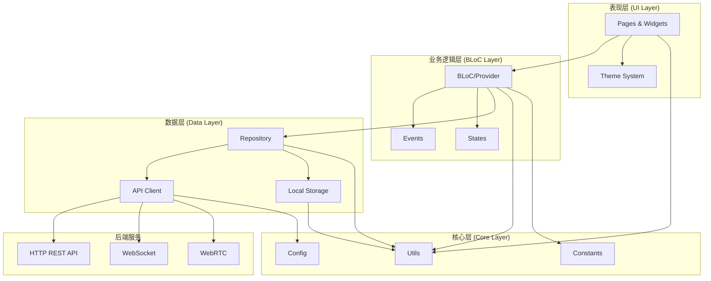

```mermaid
flowchart TB
    subgraph "表现层 (UI Layer)"
        UI[Pages & Widgets]
        Theme[Theme System]
    end
    
    subgraph "业务逻辑层 (BLoC Layer)"
        BLoC[BLoC/Provider]
        Events[Events]
        States[States]
    end
    
    subgraph "数据层 (Data Layer)"
        Repo[Repository]
        API[API Client]
        Local[Local Storage]
    end
    
    subgraph "核心层 (Core Layer)"
        Utils[Utils]
        Constants[Constants]
        Config[Config]
    end
    
    subgraph "后端服务"
        REST[HTTP REST API]
        WS[WebSocket]
        WRTC[WebRTC]
    end
    
    UI --> BLoC
    UI --> Theme
    BLoC --> Events
    BLoC --> States
    BLoC --> Repo
    Repo --> API
    Repo --> Local
    Repo --> Utils
    API --> REST
    API --> WS
    API --> WRTC
    Local --> Utils
    BLoC --> Utils
    BLoC --> Constants
    UI --> Utils
    API --> Config
```